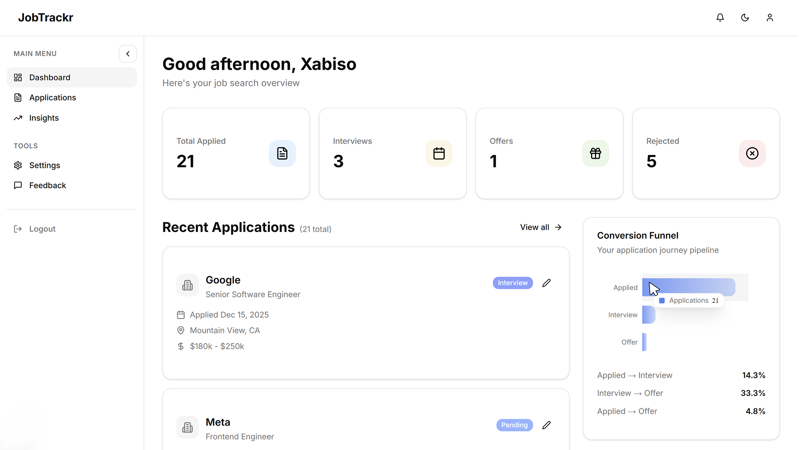
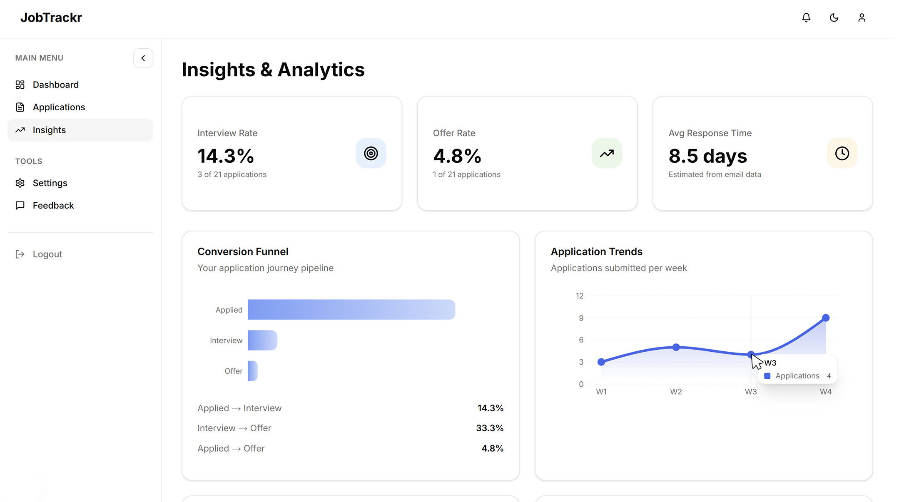

# Showcase of JobTrackr — Smart Job Application Tracker

Job hunting can be stressful. You're sending applications everywhere, getting replies from companies, scheduling interviews, and somehow you still can't remember where you applied last week. That's why I built JobTrackr — to automatically track your job applications from Gmail and show you what's actually happening with your job search. - no source code included.

## What It Does

- **Auto-pulls from Gmail**: Connect your email once and the app grabs all your application notifications
- **Organizes everything**: See all applications in one dashboard, filter by status, search for companies
- **Shows you trends**: Track how many applications per week, conversion rates, and status breakdown
- **Works on mobile**: Responsive design that looks good on any device

It's built with modern tech (Next.js, React, Tailwind, MongoDB) and designed to be actually useful, not just pretty.

## How To Use

1. Go to [JobTrackr](https://jobtrackr-xabiso.vercel.app/) / `https://jobtrackr-xabiso.vercel.app`
2. Sign in with **Google OAuth** or **Email OTP**
3. Complete onboarding (name, email tracking preferences)
4. Authorize Gmail to let the app read your emails
5. The app automatically pulls application notifications and extracts details
6. View your dashboard with KPIs, recent applications, and trends
7. Edit, add, or delete applications manually if needed

A **YouTube demo video** is coming soon to walk you through the experience.

## Screenshots

### Landing Page

### Dashboard

### Insights

**[View it yourself](https://jobtrackr-xabiso.vercel.app/)** — Try the live app to see these screens in action.

## Tech Stack

**Frontend**: Next.js 16, React, Tailwind CSS, shadcn/ui components, Recharts for charts

**Backend**: Next.js API routes, MongoDB with Mongoose, JWT sessions in HTTP-only cookies, Nodemailer for emails

**Authentication**: Google OAuth 2.0 and email-based OTP (you choose)

**Email Processing**: Custom NLP to extract company names, job titles, locations, and status from emails

## Key Features

- **Enterprise-grade security**: Rate limiting, input validation, XSS protection, and encrypted data

## Security Features

JobTrackr is built with security as a priority. Here's what protects your data:

### Authentication & Authorization

- **Email OTP with rate limiting**: 10 attempts per 15 minutes prevents brute force attacks
- **Constant-time token comparison**: Uses `crypto.timingSafeEqual()` to prevent timing attacks
- **IP-based throttling**: Multi-scope rate limiting (challenge cookie + IP hash)
- **Google OAuth 2.0**: Industry-standard authentication with CSRF protection
- **Secure sessions**: JWT tokens in HTTP-only, Secure, SameSite=Lax cookies (7-day expiration)

### Data Protection

- **HMAC-SHA256 hashing**: All tokens hashed before storage, never plaintext
- **User data isolation**: Database queries scoped to authenticated user only
- **Encrypted OAuth tokens**: Google access/refresh tokens encrypted at rest
- **Automatic session cleanup**: Expired tokens auto-deleted via MongoDB TTL indexes

### Input Validation & Sanitization

- **Length limits**: All user inputs capped (name: 100, email: 255, message: 5000 chars)
- **Email format validation**: Regex validation for all email inputs
- **HTML sanitization**: All email content escaped to prevent XSS attacks
- **Type validation**: Whitelisted feedback types, validated lookback periods

### Rate Limiting (DoS Protection)

- **OTP endpoints**: 10 requests per 15 minutes per IP
- **Contact/Feedback forms**: 15 requests per hour per IP
- **General API**: 100 requests per minute per user
- **Smart limits**: High enough for normal usage (multiple Gmail pulls, bulk deletes) while blocking obvious attacks
- **Serverless architecture**: Uses Upstash Redis for distributed rate limiting

### Security Headers & Best Practices

- **Cache-Control: no-store**: Prevents sensitive data caching
- **X-Content-Type-Options: nosniff**: Prevents MIME sniffing attacks
- **Production warnings**: Console alerts if default secrets used in production
- **CSRF protection**: SameSite cookies + OAuth state parameter validation
- **Lookback limits**: Gmail pulls capped at 120 days (4 months) to prevent API abuse

### Protected Against

| Attack Type                       | Protection                             |
| --------------------------------- | -------------------------------------- |
| SQL Injection                     | MongoDB (NoSQL) + Mongoose ODM         |
| XSS (Cross-Site Scripting)        | HTML sanitization on all outputs       |
| CSRF (Cross-Site Request Forgery) | SameSite cookies + OAuth state         |
| Brute Force Attacks               | Rate limiting + account lockouts       |
| Timing Attacks                    | Constant-time token comparison         |
| Session Hijacking                 | HTTP-only, Secure, SameSite cookies    |
| Email Injection                   | Input validation + Nodemailer escaping |
| DoS (Denial of Service)           | Rate limiting + Vercel DDoS protection |
| Enumeration Attacks               | Generic error messages                 |

**Security audit date**: January 2026 | **Status**: Production-ready

## About

This is a full-stack project I built to solve my own problem — keeping track of job applications without losing my mind. It showcases full-stack development, database design, OAuth integration, and user-focused product thinking.

---

**Built to make job hunting less stressful.**

## Why No Source Code?

This project processes real Gmail data and contains credentials/API keys.
Instead, the live demo and YouTube walkthrough showcase the full functionality.
